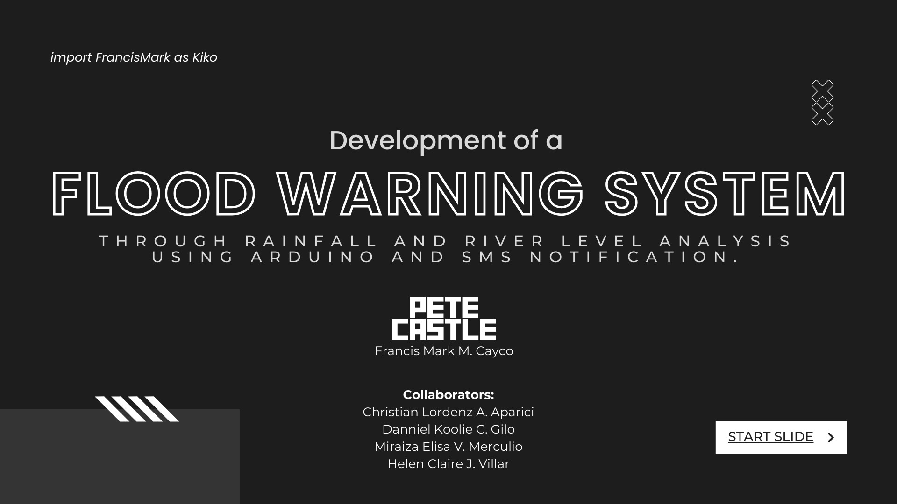
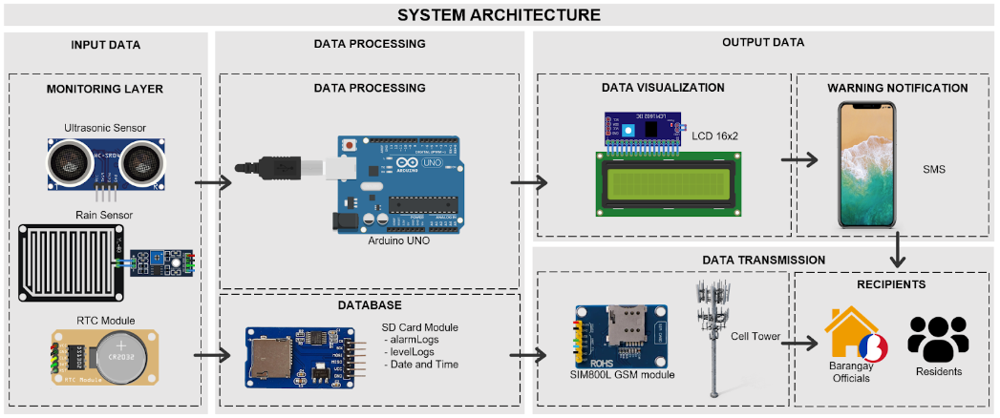
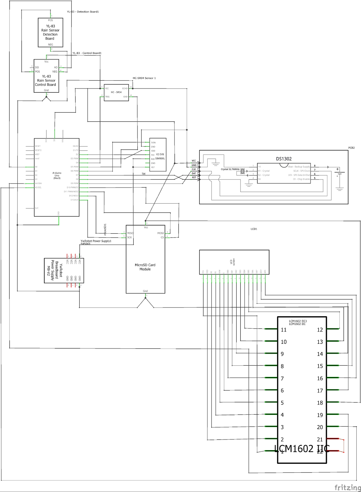
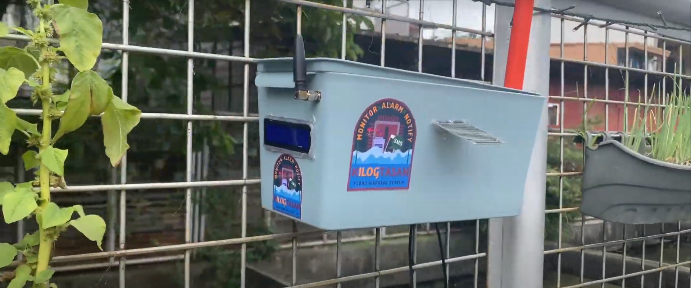

# Arduino Flood Warning System

*For Github publish*

*A Project Presented to the College of Engineering and Technology at Pamantasan ng Lungsod ng Maynila*  
*In Partial Fulfillment of the Requirements for the Degree of Bachelor of Science in Computer Engineering*

## Introduction
Climate change has made the Philippines vulnerable to adverse weather conditions such as rainfall and floods. While the country's population continues to increase, the existing infrastructure and institution is not enough to support its population.  These impacts may intensify exponentially over time, making it critical and urgent for the government and its citizens to respond and mitigate the environmental implications.

This research paper aims to be a catalyst towards addressing the underlying vulnerabilities in disaster risk reduction management through flood warning systems as a proactive and preventive approach. 

## Objective
The main objective of the study is to develop a flood monitoring and early warning system through rainfall and river level analysis with the use of Arduino and Internet of Things (IoT). The system will be able to monitor the rainfall and river level in real-time and send out alerts using SMS notifications to the barangay authorities and people living in the vicinity (barangay level) when the conditions are favorable for a flood. Specifically, this study would focus:
- To study and acquire prior knowledge about FWS.
- To design a suitable prototype using Arduino and IoT sensors for the FWS.
- To gather the following information using the prototype as an essential data for analysis in understanding the local river-level situation including rainfall measurement and rain level monitoring.
- To develop an operational early SMS warning system upon reaching a threshold for disaster preparedness.
- To present the profound changes in our local climate through monitoring and analysis.

## System Architecture

*System Architecture of the Flood Warning System Device*
The architecture of the FWS involves three layers, as illustrated in Figure 14. The (1) input data block includes sensors used for our monitoring layer. The monitoring layer includes sensors that monitor the rising river level and rain precipitation level beside the river’s vicinity. The (2) data processing block uses Arduino UNO as the system’s microcontroller and an SD Card module to store logs for the alarm and collected levels, as well as the current date and time from the RTC module. The (3) output data block uses an LCD screen for the initial presentation of measurements and a smart service through SMS for the warning notification. Lastly, the data transmission block uses a SIM800L GSM module to disseminate a warning system to the target recipients.

*Schematic Circuit Diagram of the Flood Warning System Device*
A flood warning system using an Arduino microcontroller can be implemented by connecting various sensors to the Arduino board to detect water levels and rainfall. These sensors could include an ultrasonic sensor, a rain detector, or a combination of both. The Arduino would then process the sensor data and determine if a flood warning should be issued. A possible schematic diagram for such a system would include the following components:

## Demonstation

For demonstration, click (this YouTube Link link)[https://www.youtube.com/watch?v=hcCMMzInmZ4]